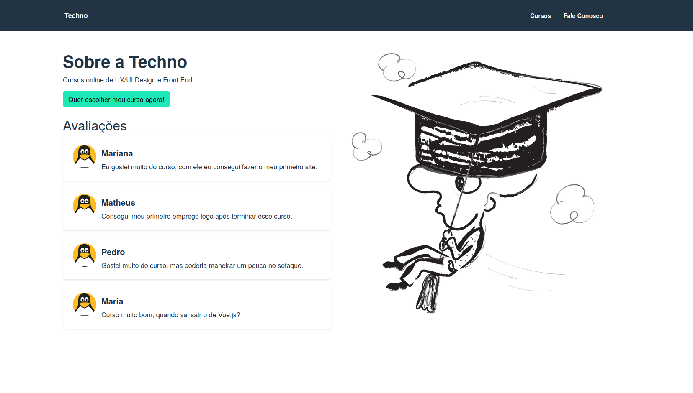

<h1 align="center"> Techno Cursos - Vue.js 2 Origamid</h1>

<p align="center">
Projeto de simples página web com navegação por rotas.
</p>

<br>

<p align="center">
  
</p>

## 🚀 Tecnologias

Esse projeto foi desenvolvido com as seguintes tecnologias:

- [Vue.js](https://vuejs.org/)
- [Vue Router](https://router.vuejs.org/)
- [Json Server](https://www.npmjs.com/package/json-server)
- [Bootstrap Vue](https://bootstrap-vue.org/)

## 💻 Projeto

O Techno Cursos é uma página simples com navegação por rotas, com consulta API Json.

## 🔖 Source

O projeto faz parte do curso de Vue.js 2 completo ofertado pela Origamid, e pode ser consultado [ATRAVÉS DESTE LINK](https://www.origamid.com/curso/vue-js-completo).

<br /><br/>

<h1> Setup Fron-end</h1>

## 🔥 Front-end

Instale as dependências do projeto:

```
npm install
```

Rode a aplicação:

```
npm run dev
```

ou

```
npm run build
```

## 🔐 Json Server

Instale o servidor Json:

```
npm install json-server
```

Rode o servidor:

```
cd api
json-server --watch api.json
```

<br /><br /><br />

<h4 align="center">
 
  <br />
  Feito com ♥ no Ubuntu 22.04 LTS
</h1>
